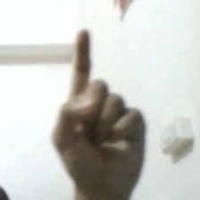
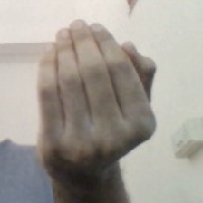
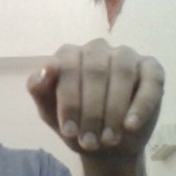
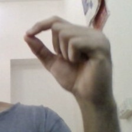
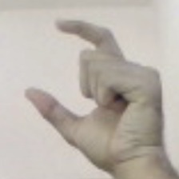
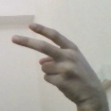
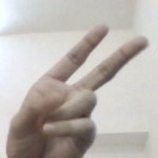

<h1 align="center">GRA</h1>
<h5>A program which performs specific actions based on recognized gestures.</h5>

> This repository is a submission to the [REVA HACK</>2020](https://revahack.com/) by team "awake ? code : sleep"
 

## :sparkles: Features
* Detect gestures: To detect hand gestures with acceptable accuracy
* Carryout function: Perform keystrokes when a gesture is detected

### Gestures:

<table>
<tr>
<td align="center"> <b>one</b></a> </td>
<td align="center"> <b>swipe_up</b></a> </td>
<td align="center"> <b>swipe_down</b></a> </td>
<td align="center"> <b>pinch_in</b></a> </td>
<td align="center"> <b>pinch_out</b></a> </td>
<td align="center"> <b>two_fingers_left</b></a> </td>
<td align="center"> <b>two_fingers_right</b></a> </td>
</tr>
</table>

 

## :joystick: Usage

`pip install -r requirements.txt`

`python gra1.py`

### Gestures with their functions:
##### One : toggle gesture detection
##### Swipe up -> swipe down : show task view -> show applications
##### Swipe down -> swipe up : show desktop -> show applications
##### Pinch in/out: Zoom in/out
##### Two fingers swipe left/right : Move to virtual desktop left/right

## :nut_and_bolt: Behind the scenes
* Our application identifies the gestures through images through **image classification**
* This image classifier is obtained from training the **MobileNetv2 model**
* Around 1000 images have been trained for each of the 7 image classes
* When it detects a specific gesture from the webcam, it performs action assigned to that gesture
* The **Midas touch problem** (inability to turn off gestures) is solved by providing a gesture (one) to toggle the application
* The program also doesn't take too many inputs in a row
 

## :seedling: Applications
* This can help us use the computer in a much more __accessible__ way
* It is also very helpful to __differently abled__ people
* Future is going to be dominated by **mixed reality**, smart glasses, etc. Gestures are the main way to interact with such technologies
* Playing games becomes more **fun**
 

## :hammer: Tools Used
* [Python](https://www.python.org/)
* [Tensorflow](https://www.tensorflow.org/api_docs) for Image-classification using ML.
* [OpenCV](https://docs.opencv.org/master/d9/df8/tutorial_root.html) for image manipulation.
* [Plyer](https://github.com/kivy/plyer) for notifications.
 

## :page_facing_up: License

 

## :man_technologist: Contributors

<table>
    <tr>
    <td align="center"><a href="https://github.com/Karthikeshwar1"> <b>Karthikeshwar</b></a> </td>
      <td align="center"><a href="https://github.com/guruprasadv22"> <b>Guruprasad V</b></a></td>
      <td align="center"><a href="https://github.com/Siddhanta-10"> <b>Siddhanta Mandal</b></a></td>
        <td align="center"><a href="https://github.com/vikasgn2"> <b>Vikas G N</b></a></td>
    </tr>
    </table>
